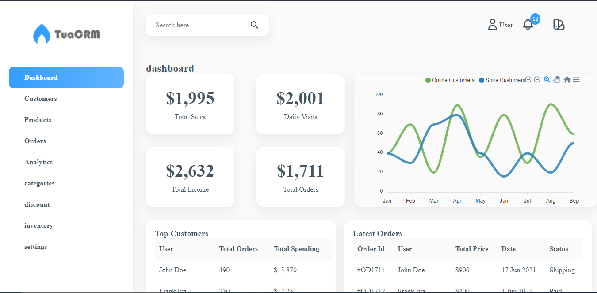
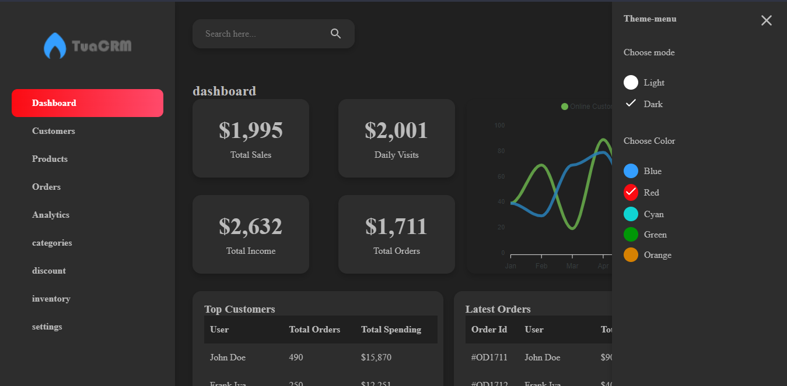
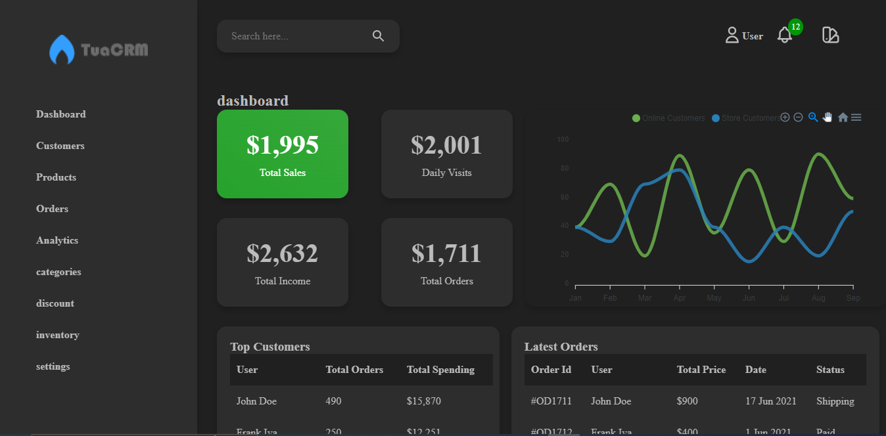

<h1>React Admin Dashboard with Multiple Themes</h1>

Admin panel with changeable color themes

<h1>🖼️ PAGEHOME</h1>

<h1 style="padding: 30px 0 0 0">
    🔨 HOW TO ROTATE
</h1>

In your terminal run `yarn dev` right after go to `http://localhost:3000`

<h1>CREDITS</h1>

GITHUB: <a>https://github.com/trananhtuat/tua-react-admin/</a>
